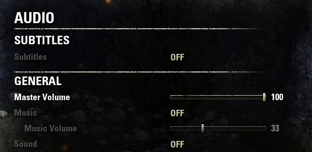
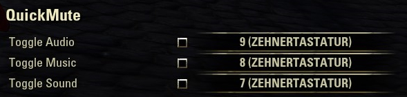

# QuickMute

|   |   |   |
|---|---|---|
| Version: | 1.0.0 |  |
| Build for game version: | 100030 |  |

 

Create a shortcut to quickly mute the complete audio, the sound or the music. If you use the shortcut again, the audio will be also unmuted again.

You have to set the controls yourself. Initially, they have no binding.

## Commands
- **/mute \[audio\]** toggle the mute status of the complete audio
- **/mute music** toggle the mute status of the music
- **/mute sound** toggle the mute status of the sound
- **/mute help** see a help output in the chat window

## Copyright
    Copyright (C) 2020 Arne Rantzen
    
    This program is free software: you can redistribute it and/or modify
    it under the terms of the GNU General Public License as published by
    the Free Software Foundation, either version 3 of the License, or
    (at your option) any later version.
    
    This program is distributed in the hope that it will be useful,
    but WITHOUT ANY WARRANTY; without even the implied warranty of
    MERCHANTABILITY or FITNESS FOR A PARTICULAR PURPOSE.  See the
    GNU General Public License for more details.
    
    You should have received a copy of the GNU General Public License
    along with this program.  If not, see <https://www.gnu.org/licenses/gpl-3.0.html>